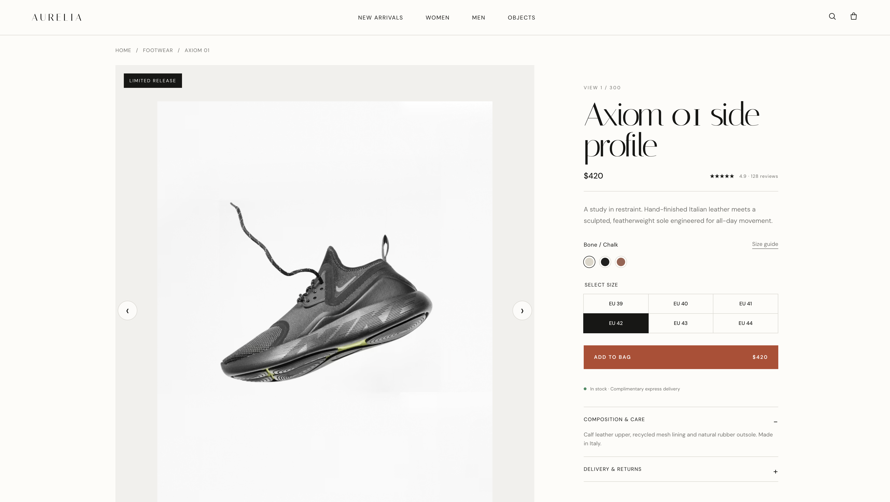
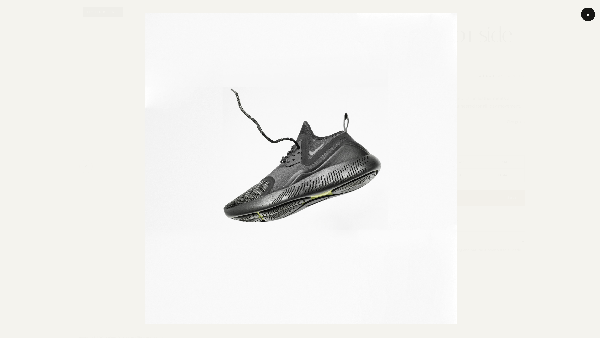
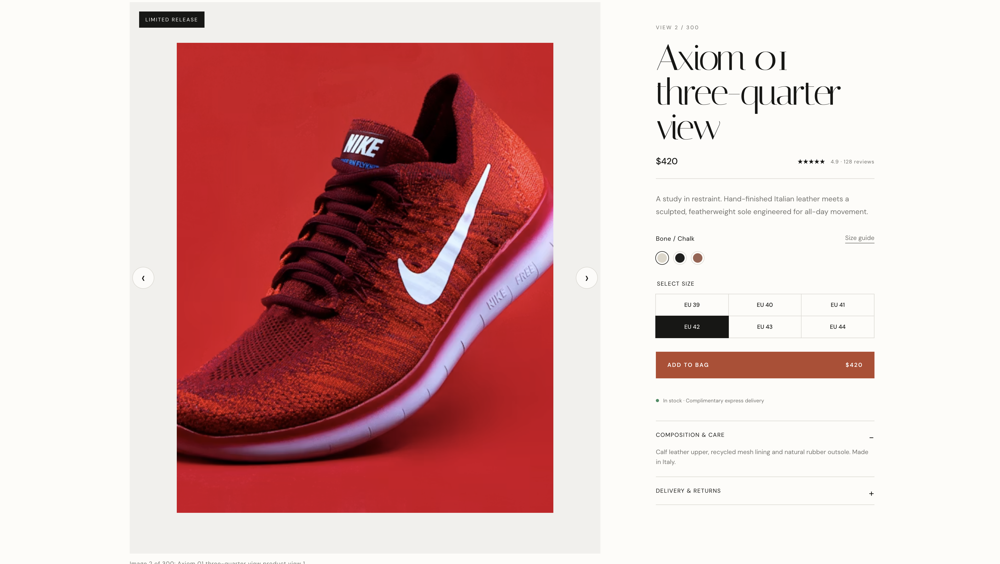

# Premium PDP Image Gallery

Take-home for **Sr. React JS Developer** — a production-style Product Detail Page gallery for ~300 high-resolution images, each with 7 variants (thumbnail → original).

Built with React + TypeScript. Focus: performance, clean architecture, and a clear frontend design doc.

## Screenshots

### Product detail page + gallery


### Zoom viewer (pan / pinch ready)


### Navigation across 300 images


## What’s inside

- Feature-based gallery module (`src/features/product-gallery`)
- Virtualized thumbnail strip + IntersectionObserver lazy loading
- Responsive AVIF / WebP / JPEG with progressive blur → HD
- Adjacent-image preload + zoom preload on hover / touch
- Bounded in-memory image cache
- Save-Data / slow-network aware loading policy
- Keyboard, swipe, and transform-based zoom
- Mock data: 300 images × 7 variants
- Frontend TDD: [PDP_IMAGE_GALLERY_TDD.md](./PDP_IMAGE_GALLERY_TDD.md)

## Run locally

```bash
npm install
npm run dev
```

## Verify

```bash
npm run build
npm run lint
```

## Design doc

Read [PDP_IMAGE_GALLERY_TDD.md](./PDP_IMAGE_GALLERY_TDD.md) for architecture, data contracts, loading strategy, performance budgets, testing, risks, rollout, and how this scales past 1,000 images.
